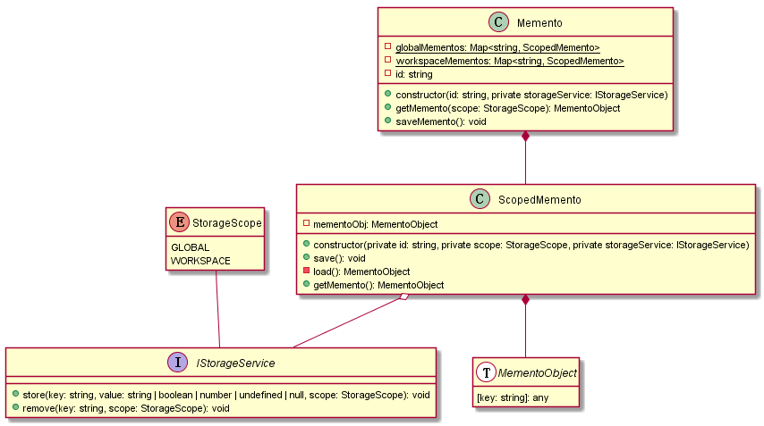
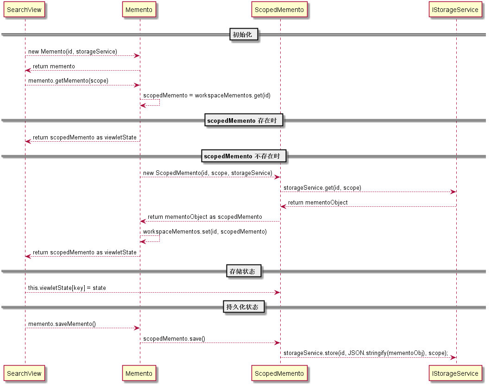

# MEMENTO（备忘录）——对象行为型模式

## 意图

在不破坏封装性的前提下，捕获一个对象的内部状态，并在该对象之外保存这个状态。这样以后就可以将该对象恢复到原先保存的状态。

## 动机

有时有必要记录一个对象的内部状态。为了允许用户取消不确定的操作或者从错误中恢复过来，需要实现检查点和取消机制，而要实现这样的机制，你必须先将状态信息保存在某处，这样才能将对象恢复到它们先前的状态。但是对象通常封装了其部分或所有的状态信息，使得其状态不能被其他对象访问，也就不可能在该对象之外保存其状态。而暴露其内部状态又将违反封装的原则，可能有损应用的可靠性和扩展性。

一个备忘录（memento）是一个对象，它存储另一个对象在某个瞬间的内部状态，而后者称为备忘录的原发器（originator）。当需要设置原发器的检查点时，取消操作机制会向原发器请求一个备忘录。原发器用描述当前状态的信息初始化该备忘录。只有原发器可以向备忘录中存取信息，备忘录对其他的对象“不可见”。

## 适用性

在以下情况下使用备忘录模式：

* 必须保存一个对象在某一个时刻的（部分）状态，这样以后需要时它才能恢复到先前的状态。
* 如果一个用接口来让其他对象直接得到这些状态，将会暴露对象的实现细节并破坏对象的封装性。

### 类图

### 时序图

